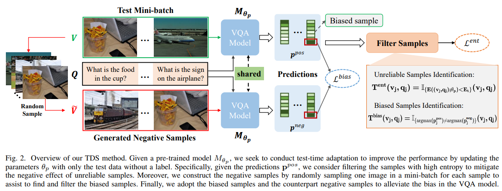

# TDS
We provide the PyTorch implementation for [Test-Time Model Adaptation for Visual Question Answering with Debiased Self-Supervisions](https://ieeexplore.ieee.org/stamp/stamp.jsp?tp=&arnumber=10173554) (IEEE TMM 2023).

<p align="center">

</p>

## Dependencies
* Python 3.6
* PyTorch 1.1.0
* dependencies in requirements.txt
* We train and evaluate all of the models based on one TITAN Xp GPU

## Getting Started

### Installation
1. Clone this repository:

        git clone https://github.com/Zhiquan-Wen/TDS.git
        cd TDS

2. Install PyTorch and other dependencies:

        pip install -r requirements.txt

### Download and preprocess the data

```
cd data 
bash download.sh
python preprocess_features.py --input_tsv_folder xxx.tsv --output_h5 xxx.h5
python feature_preprocess.py --input_h5 xxx.h5 --output_path trainval 
python create_dictionary.py --dataroot vqacp2/
python preprocess_text.py --dataroot vqacp2/ --version v2
cd ..
```

### Download VQA-CP v2 dataset
 You can download the [VQACP v2 dataset](https://drive.google.com/file/d/1xQ6O7FG4b3C6yLFmT-5IVbbD4ECNmvj3/view?usp=sharing)  with Google Drive.


### Download the baseline models pre-trained on VQA-CP v2 training set 

 | Model | Link| Acc (%)|
 | :-: | :-: | :-: |
 |UpDn (VQACP-v2)|[https://Zhiquan-Wen/TDS/releases/download/Pretrained_Model_on_VQACPv2_train/model.pth](https://github.com/Zhiquan-Wen/TDS/releases/download/Pretrained_Model_on_VQACPv2_train/model.pth)| 40.94|
 |UpDn (VQACP-v1)|[https://cors.isteed.cc/github.com/Zhiquan-Wen/TDS/releases/download/Pretrained_Model_on_VQACPv1_train/model.pth](https://github.com/Zhiquan-Wen/TDS/releases/download/Pretrained_Model_on_VQACPv1_train/model.pth)| 38.78|
 |LXMERT (VQACP-v2)|[https://gh.ddlc.top/https://github.com/Zhiquan-Wen/TDS/releases/download/Pretrained_Model_on_VQACPv2_train_lxmert/BEST.pth](https://github.com/Zhiquan-Wen/TDS/releases/download/Pretrained_Model_on_VQACPv2_train_lxmert/BEST.pth)| 41.72|
 |LXMERT (VQACP-v1)|[https://git.xfj0.cn/https://github.com/Zhiquan-Wen/TDS/releases/download/Pretrained_Model_on_VQACPv1_train_lxmert/BEST.pth](https://github.com/Zhiquan-Wen/TDS/releases/download/Pretrained_Model_on_VQACPv1_train_lxmert/BEST.pth)| 38.21|
 |ViLBERT (VQACP-v2)|[https://gh.h233.eu.org/https://github.com/Zhiquan-Wen/TDS/releases/download/Pretrained_Model_on_VQACPv2_train_vilbert/pytorch_model_18.bin](https://github.com/Zhiquan-Wen/TDS/releases/download/Pretrained_Model_on_VQACPv2_train_vilbert/pytorch_model_18.bin)|40.75|
 |ViLBERT (VQACP-v1)|[https://ghps.cc/https://github.com/Zhiquan-Wen/TDS/releases/download/Pretrained_Model_on_VQACPv1_train_vilbert/pytorch_model_12.bin](https://github.com/Zhiquan-Wen/TDS/releases/download/Pretrained_Model_on_VQACPv1_train_vilbert/pytorch_model_12.bin)|39.59|


### Test-Time Adaptation 
* Evaluate and Train our model simultaneous
```
CUDA_VISIBLE_DEVICES=0 python TDS.py --dataroot data/vqacp2/ --img_root data/coco/trainval_features --output saved_models_cp2/test.json --batch_size 512 --learning_rate 0.01 --rate 0.2 --checkpoint_path path_for_pretrained_UpDn_model
``` 

### Evaluation
* Compute detailed accuracy for each answer type on a json file of results:
```
python comput_score.py --input saved_models_cp2/test.json --dataroot data/vqacp2/
```
* Our results of UpDn for [VQACP v1](https://cors.isteed.cc/github.com/Zhiquan-Wen/TDS/releases/download/UpDn_vqacpv1_results/test.json) and [VQACP v2](https://gh.h233.eu.org/https://github.com/Zhiquan-Wen/TDS/releases/download/UpDn_vqacpv2_results/test.json) results can be downloaded.

## Quick Reproduce

1. **Preparing enviroments**: we prepare a docker image (built from [Dockerfile](https://github.com/Zhiquan-Wen/D-VQA/blob/master/docker/Dockerfile)) which has included above dependencies, you can pull this image from dockerhub or aliyun registry:

```
docker pull zhiquanwen/debias_vqa:v1
```


```
docker pull registry.cn-shenzhen.aliyuncs.com/wenzhiquan/debias_vqa:v1
docker tag registry.cn-shenzhen.aliyuncs.com/wenzhiquan/debias_vqa:v1 zhiquanwen/debias_vqa:v1
```

2. **Start docker container**: start the container by mapping the dataset in it:

```
docker run --gpus all -it --ipc=host --network=host --shm-size 32g -v /host/path/to/data:/xxx:ro zhiquanwen/debias_vqa:v1
```

3. **Running**: refer to `Download and preprocess the data`, `Training` and `Evaluation` steps in `Getting Started`.

## Reference
If you found this code is useful, please cite the following paper:
```
@inproceedings{TDS,
  title     = {Test-Time Model Adaptation for Visual Question Answering with Debiased Self-Supervisions},
  author    = {Zhiquan Wen, 
               Shuaicheng Niu, 
               Ge Li,
               Qingyao Wu, 
               Mingkui Tan, 
               Qi Wu},
  booktitle = {IEEE TMM},
  year = {2023}
}
```
